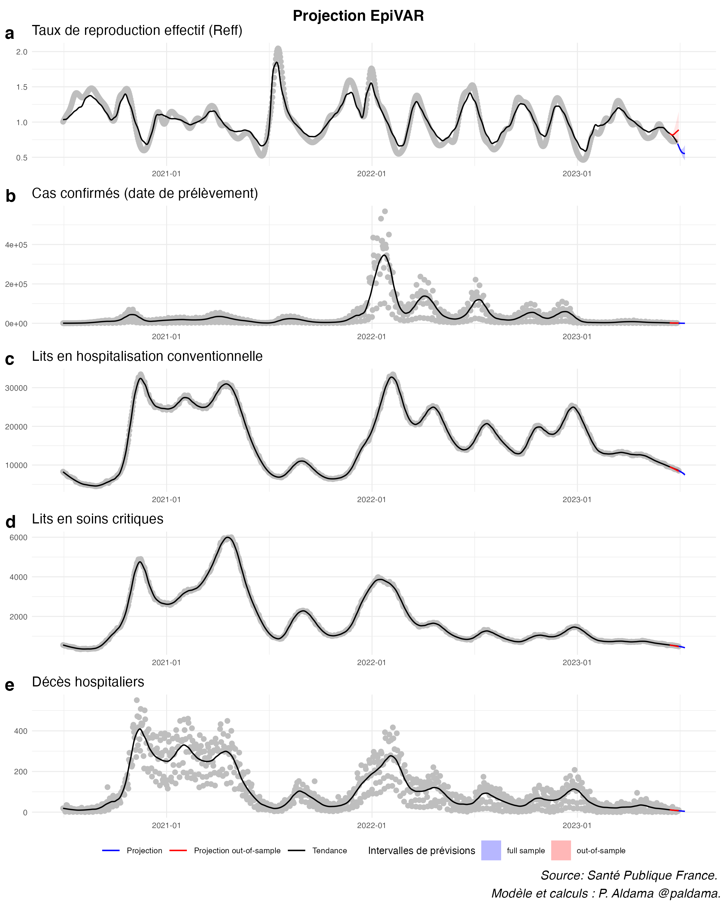

```{r setup, include = FALSE}
knitr::opts_chunk$set(
  collapse = TRUE,
  comment = "#>"
)
```

### Description du modèle

EpiVAR est un modèle économétrique de type Vecteur Auto-Regressif (VAR) pour la prévision à court-terme de la dynamique de l'épidémie de Covid en France, à l'échelle nationale. Il est estimé par MCO sur données journalières pour le taux de reproduction effectif, le nombre de cas confirmés, d'hospitalisation, de lits occupés en soins critiques et de décès hospitaliers. Il s'écrit tel que:

$$ 
Y_t = A_1 Y_{t-1} + ... + A_p Y_{t-p} + u_t 
$$
avec le vecteur des variables endogènes : $$Y_t = \begin{pmatrix}  \Delta \log R_t \\ \Delta \log  Cas_t\\ \Delta \log Hosp_t \\ \Delta \log Rea_t \\ \Delta \log Décés_t  \end{pmatrix} $$
Le vecteur des résidus $u_t$ est supposé être i.i.d. tel que $\mathbb{E}[u_t] = 0$, $\mathbb{E}[u_tu_t']=\Sigma$ et $\mathbb{E}[u_tu_{t-1}']=0$. On retient une spécification avec $p=28$ retards. ^[Pour certaines équations, l'hypothèse d'absence de correlation sérielle $\mathbb{E}[u_tu_{t-1}']=0$ ne peut cependant pas être rejetée.] 

On choisir de ne pas inclure un vecteur de constantes dans la mesure où l'état-stationnaire de l'épidémie implique une stabilité de l'ensemble de ces variables (i.e. $\Delta \log x_t = 0$); en revanche, dans la mesure où le modèle est écrit en différence-première, nous ne faisons pas d'hypothèse sur le *niveau* des variables du VAR.

#### Fonctions impulsions-réponses et décomposition de la variance de l'erreur de prévision

Les deux figures suivantes donnent un aperçu des propriétés du modèles EpiVAR en réponse à des chocs orthogonalisés (par décomposition de Cholesky de la matrice de variance-covariance $\Sigma$). Les fonctions d'impulsions-réponses montrent la réponse cumulée de chacune des variables (en colonnes) à des chocs sur chacune de ces variables (en lignes).

{width=100%}
Une autre façon de considérer ces propriétés est de calculer la décomposition de la variance de l'erreur de prévision à partir de ces fonctions impulsions-réponses, pour chacun de ces chocs.

{width=100%}

### Préparation des données

On commence tout d'abord par appliquer [la correction des jours fériés proposées par Santé Publique France](https://www.google.com/url?sa=t&rct=j&q=&esrc=s&source=web&cd=&ved=2ahUKEwj9qp2S9c77AhX-YqQEHTuxBXMQFnoECBMQAQ&url=https%3A%2F%2Fwww.santepubliquefrance.fr%2Fcontent%2Fdownload%2F335872%2Ffile%2Fnote_methodo_jours_feries_15042021.pdf&usg=AOvVaw3ECFJ89paSOP0w638FRzvD).

{width=100%}
On calcule ensuite le taux de reproduction effectif à partir du package EpiEstim, car la série temporelle du taux de reproduction effectif fournie par SPF s'arrête plus tôt que celle du nombre de cas confirmés. On calcule un taux de reproduction sous l'hypothèse d'une moyenne de l'intervalle sériel $\mu = 5.19$ et un écart-type $\sigma = 0.42$, basé sur une méta-analyse des estimations disponibles.^[Voir https://www.ncbi.nlm.nih.gov/pmc/articles/PMC7448781/] Pour ce calcul, on se base sur la série de cas confirmés en moyenne mobile sur 7 jours et corrigée des jours fériés.

{width=100%}

Enfin, on opère un double lissage de l'ensemble des séries restantes, d'abord en calculant la moyenne mobile sur les 7 derniers jours, puis par des regressions LOESS des moyennes mobiles elle-mêmes.^[Le fait de calculer une moyenne mobile *backward* sur 7 jours avant l'utilisation du lissage LOESS permet de réduire le biais de fin d'échantillon quand on calcule la tendance à partir du modèle LOESS. Le lisseur LOESS est calculé pour un paramètre de *span = 0.05*.]

### Projections 

On estime ensuite le modèle sur échantillon complet (*full sample*) et sur un échantillon réduit de 2 semaines (*out-of-sample*) pour produire deux projections. 

- La première utilise toute l'information disponible à la dernière date pour laquelle on dispose d'observation pour chacune des variables.

- La seconde n'utilise pas les deux dernières semaines d'observations pour évaluer ce qu'aurait donné une projection passée.^[Il faut cependant noter un caveat à cet exercice. Pour se placer dans une véritable situation de projection *out-of-sample*, il faudrait en théorie tronquer la base de données et appliquer le même traitement des données (estimation du R avec EpiEstim, double-lissage des séries). En omettant cette étape, on néglige la possibilité que la tendance estimée - à partir de laquelle on estime le modèle et réalise les projections - puisse être révisée au fur et à mesure que l'on dispose de nouvelles données. En pratique, le double-lissage des séries permet de réduire au maximum ces révisions mais on parlerait néanmoins de *pseudo out-of-sample*.] 


{width=100%}
